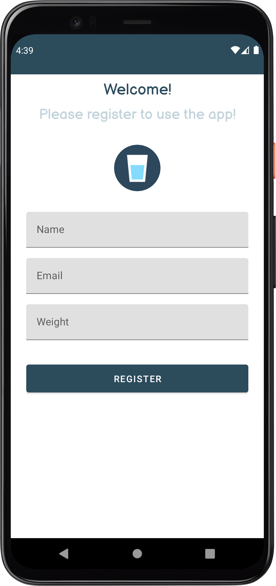
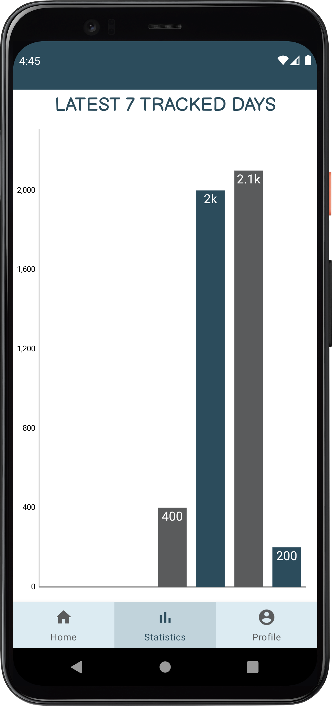
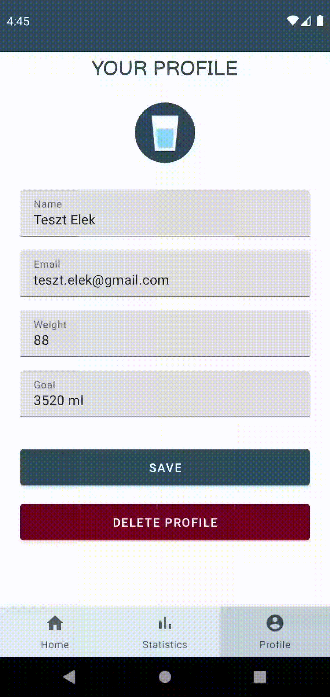

# Hydration App

The purpose of this application is to record our daily liquid consume to be aware to reach the recommended value and live a healthier life.

## Register View
To use the app, we have to register with a few information to calculate the recommended daily consume value.

## Home View
After logging in, we get to the home page, where we can add new drinks or delete existing ones, in case we made a mistake. Here we can also see our progress for the day.

   New drink             |  Delete drink
:-------------------------:|:-------------------------:
 |   

## Statistics View

In the statistics view, we can see the intakes of our last 7 tracked days.

|

## Profile View
In the profile menu, we can change our personal informations. When we change our weight, the goal is automatically recalculated.

